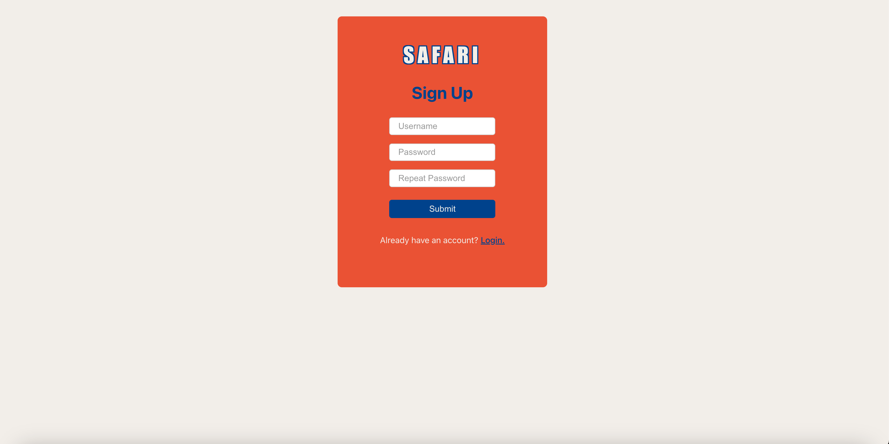
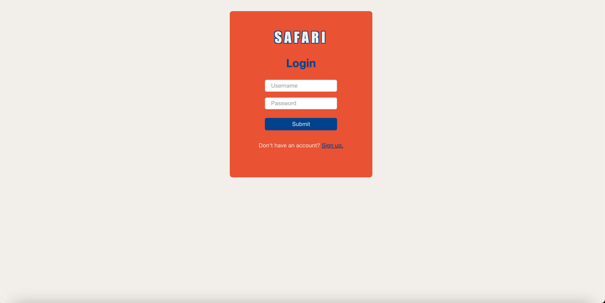
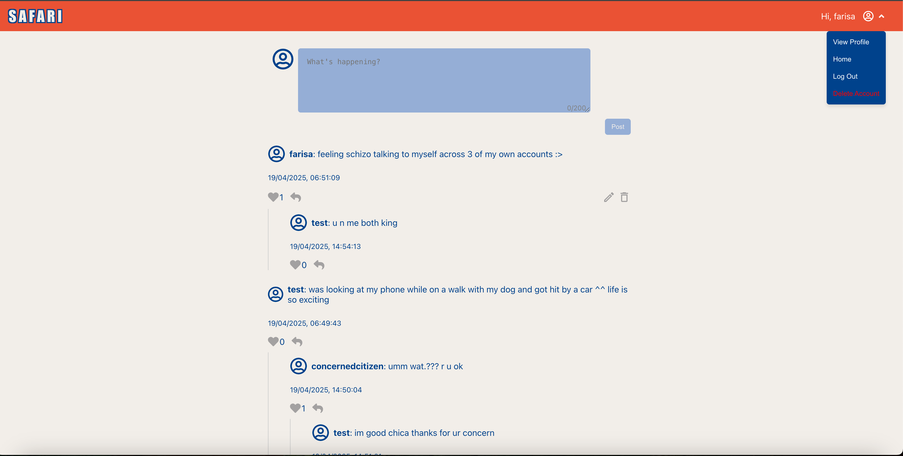

# Simple Social Media App (React, Node.js, ASP.NET)
Simple application that allows users to share posts with other people, read others peoples posts, and comment on each others posts.

Built using React, Node.js, and ASP.NET (C#).

## TO RUN:
cd into frontend: `npm start`

cd into backend: `dotnet run`

## CURRENT PROGRESS:
- signup:

- login:

- main:

## TODO:

### To Fix:

- [x] change posts to also contain userid so i can find them based on user id ==> change finduserposts to use userid instead of username
- [x] treat comment as post object, but somehow indicate that it is a post. this allows me to edit and delete my comments, as well as reply to comments.
- [ ] error handling for post related functions in backend and frontend

### Main Functionality:

#### Users:
- [x] create user
- [x] log in
- [x] log out
- [x] delete account. when user deletes account, all posts posted by user should also be deleted.
- [ ] authentication
- [ ] add profile photo
- [ ] user verification with email etc.

#### Posts:
- [x] create post
- [x] view other peoples post
- [x] view your own post
- [x] edit your own posts
- [x] delete your own posts
- [x] comment on other peoples posts
- [x] delete comment
- [x] thumbs up/thumbs down
- [ ] add photos/videos to posts

#### Private messages:
- [ ] create chatroom between two or more users
- [ ] send messages to each other
- [ ] reply to each others messages

#### UI:
- [x] login/create account ui
- [x] post component ui
- [x] post creation ui
- [x] homepage ui
- [ ] profile ui
- [ ] chatroom ui
